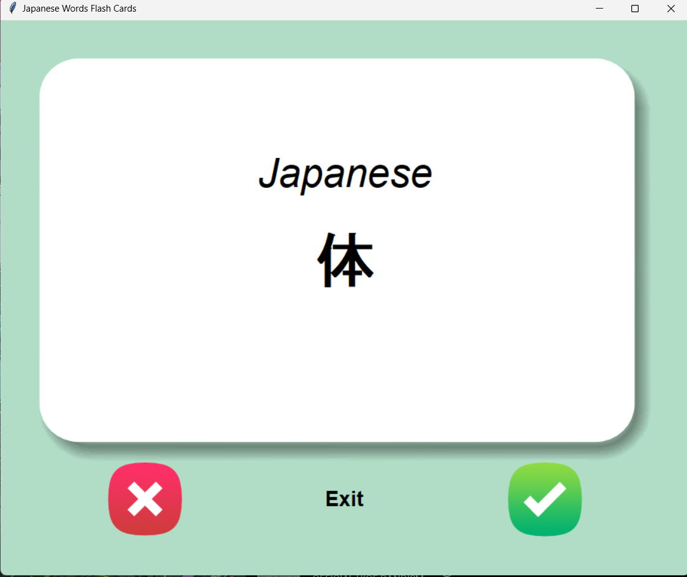
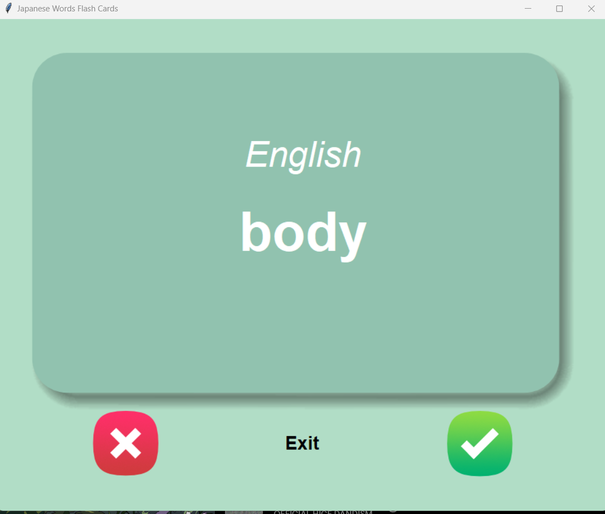

# Japanese <-> English FlashCard Program
## Features
### 1. Main feature
- This program is a flashcard program where it will show the user a random word to be learned. Flashcard will automatically flip after 3 seconds if no user input was triggered. There are 3 types of user input available to be triggered and each input will do different task (will be explained on the next section). This program will create a file of words user hasn't learned/mastered so the next time the user boots up the program, it will continue the user's progress through the list of unlearned/unmastered words.
### 2. Buttons
- Cross Button : When clicked, word showed on screen might be displayed again in the future
- Checkmark Button : When clicked, word showed on screen will be removed from list and will not appear in the future
- Exit Button : Saves current list of unlearned/unmastered words into a file and stops program from running.

## Images (UI of the program)
 - Japanese UI

 - English UI
